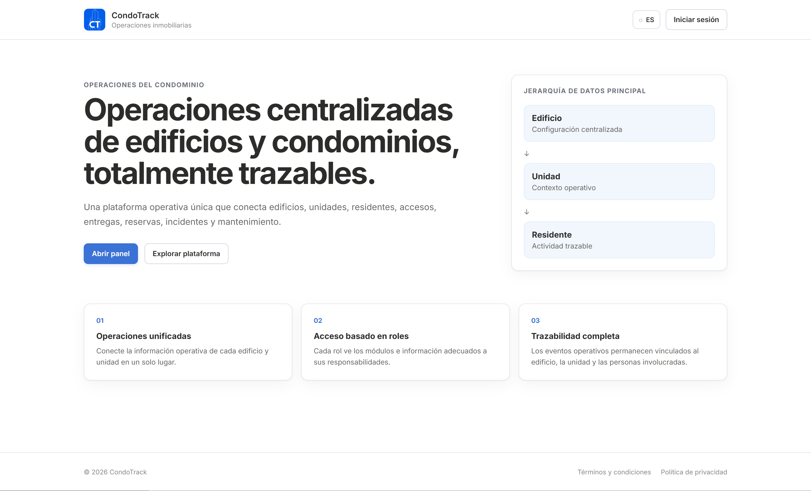
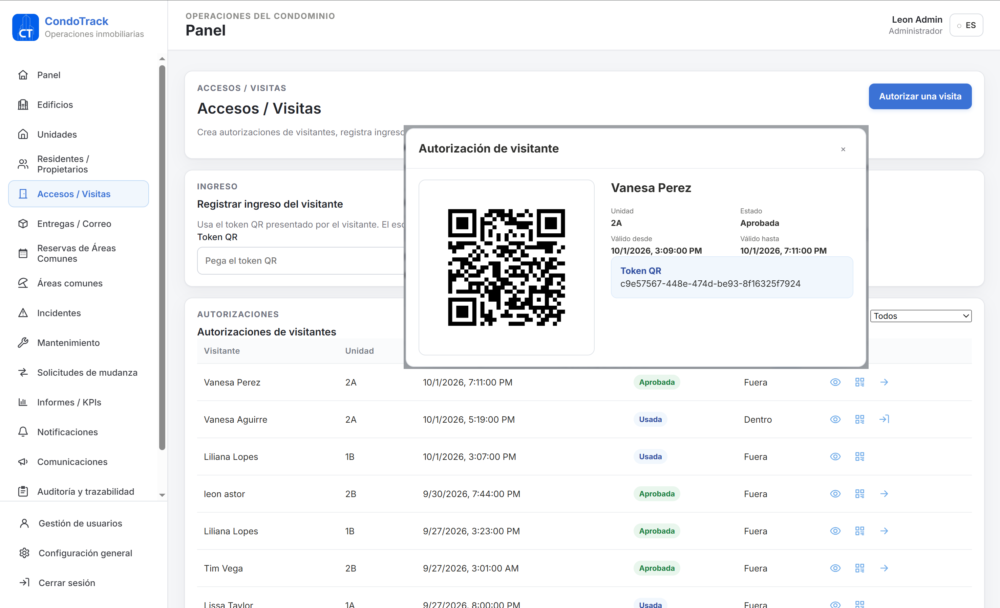
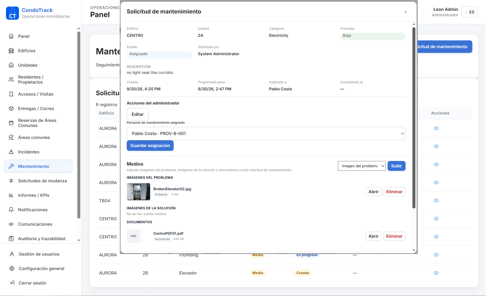
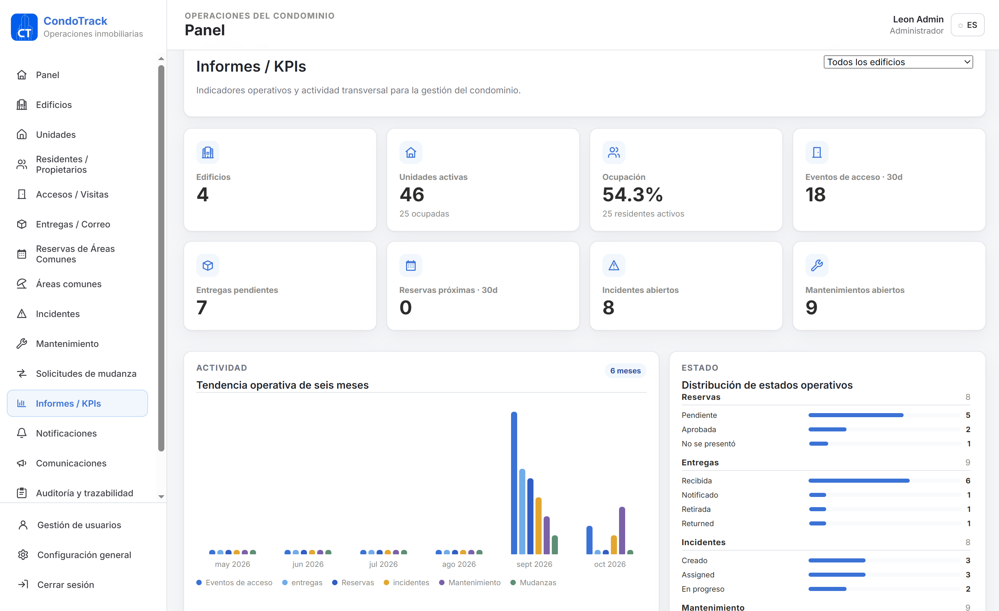

# S08-26-Equipo 26

   
    
  
  

# CondoTrack

Centralized building and condominium management platform: residents, access
control, deliveries, common area bookings, move requests, incidents,
maintenance and notifications — all traceable back to `Building → Unit → Resident`.

Live Demo: https://testimonial-cms-main.vercel.app  
API Docs: https://n-cs1125e44.vercel.app/api-docs

---

## Equipo de Desarrollo

| Rol               | Nombre       | LinkedIn                                      | GitHub                              | Foto                                      |
|-------------------|--------------|-----------------------------------------------|-------------------------------------|-------------------------------------------|
| UX/UI | Liliana Lopes  | [LinkedIn](https://www.linkedin.com/in/lilianavanesalopes) | [GitHub](https://github.com/lilian1406) |  |
| Fullstack Lead & Testing      | León Asturizaga  | [LinkedIn](https://www.linkedin.com/in/leon-asturizaga-94a80377/) | [GitHub](https://github.com/leonasturizaga)   |  |
| Frontend      | Wilson Acevedo Molinares  | [LinkedIn](https://www.linkedin.com/in/wilson-acevedo-95226a6a/)   | [GitHub](https://github.com/WILARTURO)    |  |
| Backend | Diego Jorges  | [LinkedIn](https://linkedin.com/) | [GitHub](https://github.com/djorges) |  |

---

## Tecnologías

### Backend

### Frontend

### UX-UI & Testing

---

## Characteristics

- Authentication                  ✅
- JWT                             ✅
- Central permission model        ✅
- Role enforcement                ✅
- Ownership/scope enforcement     ✅
- Building CRUD foundation        ✅
- Unit CRUD foundation            ✅
- Resident CRUD foundation        ✅
- Resident ↔ Unit relationship    ✅
- Operational modules             ✅
- Administrator user management   ✅
- Reports/KPIs                    ✅

---

## Deployment Links

- Frontend: https://s08-26-equipo-26-condotrack.vercel.app/
- Backend: https://s08-26-equipo-26-condotrack.onrender.com/api/health
- API: https://s08-26-equipo-26-condotrack.onrender.com/swagger-ui.html

## Condotrack Structure

- ├── backend/          → Spring Boot (Java 21, Maven, PostgreSQL, Spring Security)
- ├── frontend/         → React + Vite (JavaScript, i18n)
- ├── docs/             → Documentación API (Swagger/OpenAPI)
- └── README.md

---
## 💻 Thanks

  

